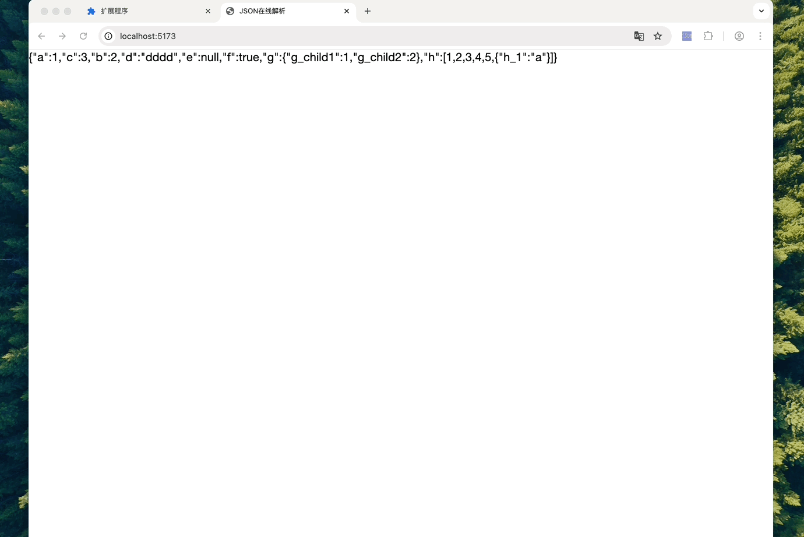
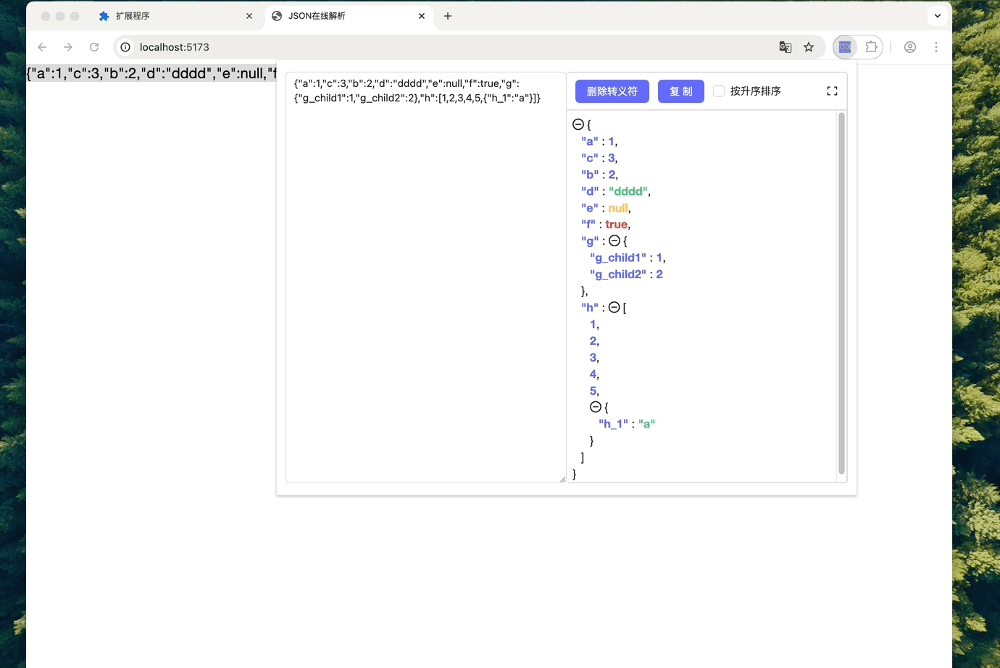

# JSON Parse Browser Extension

[中文](./readme.md) | English

A Chrome browser extension for parsing and formatting JSON.

## Features

- 🚀 Fast JSON string parsing
- 🎨 JSON formatting display
- 📋 Support copying formatted results
- 🔍 Support expanding/collapsing JSON nodes
- ⚡️ Support removing escape characters
- 📊 Support sorting by key name in ascending order
- 🖱️ Support right-click menu for quick parsing of selected text
- 🔄 Support fullscreen mode viewing
- 🎯 Support quick location of incorrect JSON string positions

## Installation

1. [Download the zip file](https://github.com/MikeNoBug/json-web-ext/releases/download/1.0.1/json-web-ext-1.0.1.zip) and extract it
2. Open Chrome browser and go to the extensions page (chrome://extensions/)
3. Enable "Developer mode"
4. Click "Load unpacked extension"
5. Select the project's build directory

## Feature Demonstration

### Method 1: Click Extension Icon


1. Click the extension icon in the browser toolbar
2. Paste or input JSON string in the input box
3. Automatically parse and display formatted results

### Method 2: Right-click Menu


1. Select JSON text on the webpage
2. Right-click and select "Parse JSON"
3. Automatically open parsing window and display results

## Core Features

### JSON Formatting and Collapsing



Supports JSON data formatting display and node expansion/collapse operations, making it easier to browse complex JSON structures.

### Quick Error Location


### More Useful Features



- One-click copy of formatted results
- Sort by key name in ascending order
- Remove escape characters
- Fullscreen mode viewing
- Quick error location

## Project Structure

```
json-web-ext/
├── packages/
    ├── background/ # Background scripts
    ├── content/ # Content scripts
    ├── popup/ # Popup window
    └── config/ # Configuration files
```

## Development Guide

### Requirements

- Node.js >= 16
- pnpm

### Install Dependencies

```bash
pnpm install
```

### Development Mode

```bash
pnpm run dev:ext
```

### Build

```bash
pnpm run build:ext
```
