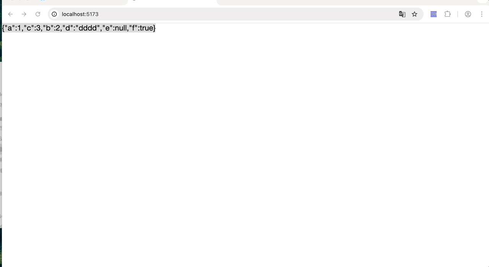
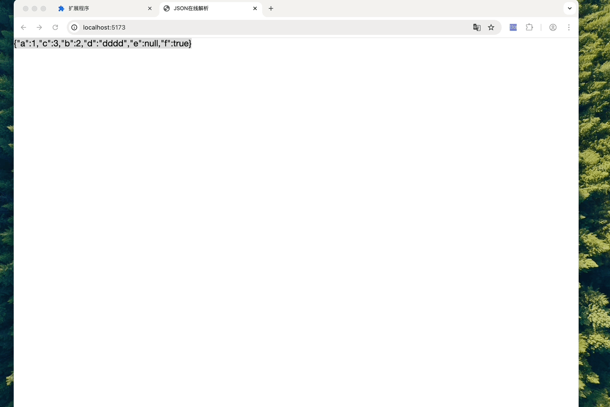
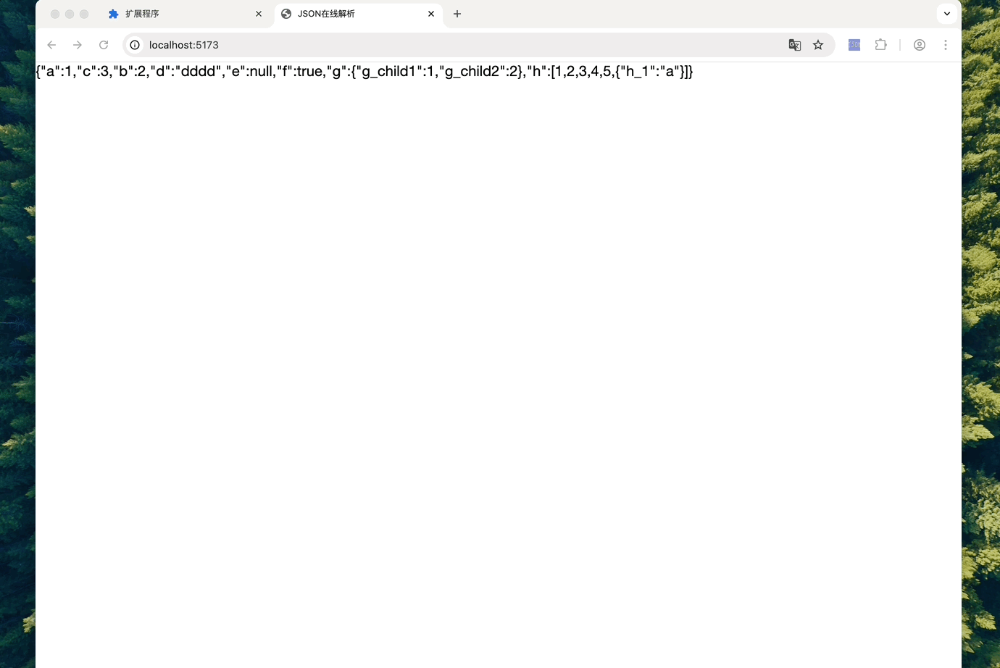
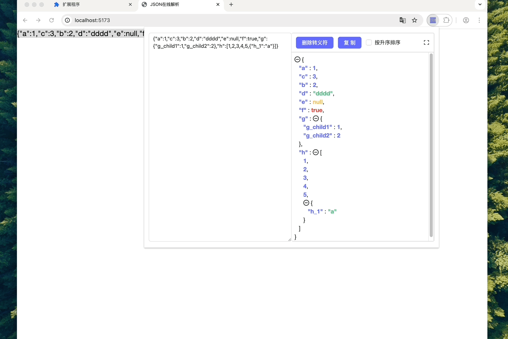
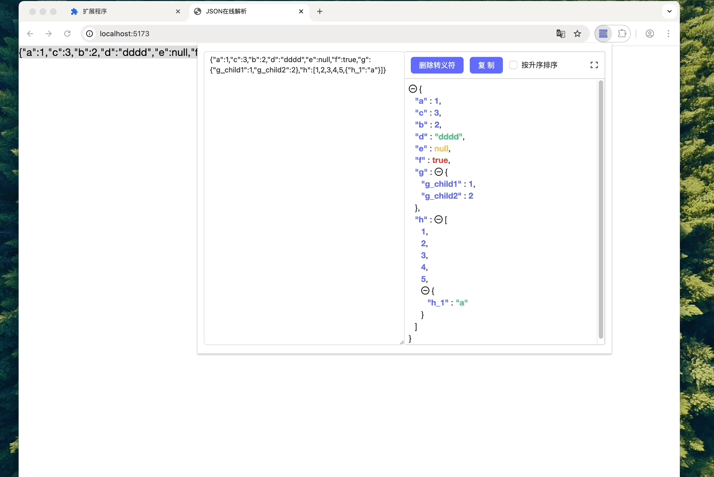

# JSON Parse 浏览器扩展

中文 | [English](./README_EN.md)

一个用于解析和格式化 JSON 的 Chrome 浏览器扩展。

## 功能特点

- 🚀 快速解析 JSON 字符串
- 🎨 格式化 JSON 显示
- 📋 支持复制格式化后的结果
- 🔍 支持展开/折叠 JSON 节点
- ⚡️ 支持删除转义符
- 📊 支持按键名升序排序
- 🖱️ 支持右键菜单快速解析选中文本
- 🔄 支持全屏模式查看
- 🎯 支持快速定位 JSON 字符串不正确的位置

## 安装方法

1. [下载压缩包](https://github.com/MikeNoBug/json-web-ext/releases/download/1.0.1/json-web-ext-1.0.1.zip)，解压缩
2. 打开 Chrome 浏览器，进入扩展程序页面（chrome://extensions/）
3. 开启"开发者模式"
4. 点击"加载已解压的扩展程序"
5. 选择项目的构建目录

## 功能演示

### 方式一：点击扩展图标解析



1. 点击浏览器工具栏中的扩展图标
2. 在输入框中粘贴或输入 JSON 字符串
3. 自动解析并显示格式化结果

### 方式二：右键菜单



1. 在网页中选中 JSON 文本
2. 右键点击，选择"解析 JSON"
3. 自动打开解析窗口并显示结果

## 核心功能展示

### JSON 格式化与折叠



支持 JSON 数据的格式化显示，以及节点的展开/折叠操作，让您更轻松地浏览复杂的 JSON 结构。

### 错误快速定位



### 更多实用功能



- 一键复制格式化后的结果
- 按键名升序排序
- 删除转义字符
- 全屏模式查看
- 快速定位错误位置

## 项目结构

```
json-web-ext/
├── packages/
    ├── background/ # 后台脚本
    ├── content/ # 内容脚本
    ├── popup/ # 弹出窗口
    └── config/ # 配置文件
```

## 开发说明

### 环境要求

- Node.js >= 16
- pnpm

### 安装依赖

```bash
pnpm install
```

### 开发模式

```bash
pnpm run dev:ext
```

### 构建

```bash
pnpm run build:ext
```
